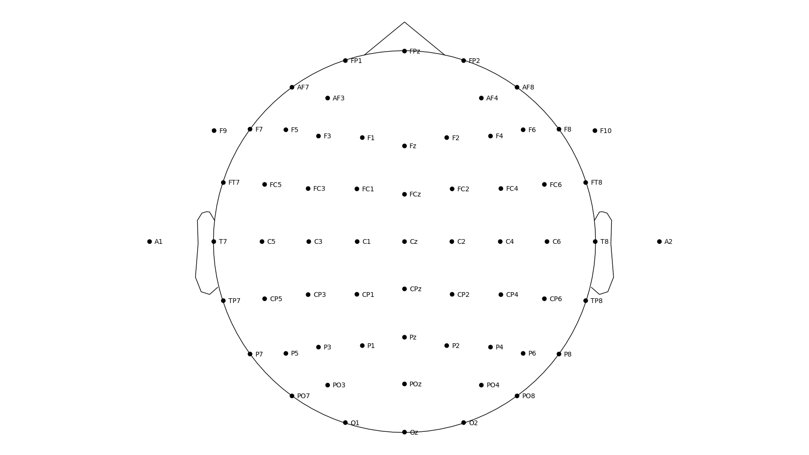

# Repositorio para procesamiento y análisis de señales y datos asociados al proyecto Handwritting

El título del proyecto es **Estudio de factibilidad de decodificación de escritura imaginada a mano alzada usando EEG de alta densidad con aplicaciones a interfaces no convencionales de comunicación.**

Proyecto para estudiar la factibilidad de decodificación del trazo continuo de letras del alfabeto español a partir del electroencefalograma.

Este repositorio contiene los script en Python para porcesar y analizar las señales de las pesonas voluntarias sometidas al protocolo experimental.

- [Aplicación Python](https://github.com/lucasbaldezzari/pyhwr).
- [Aplicación Android](https://github.com/lucasbaldezzari/handwritingrecording)

## Montaje de electrodos

Se registraron 67 canales en total. 
1. 64 canales de EEG como se muestra en la figura del montaje. Canales 1 a 64.
2. 1 canal de EMG. Canal 65.
3. 2 canales de EOG. El canal 66 se uso para registro de movimientos horizontales y el 67 para registro de movimientos verticales.

